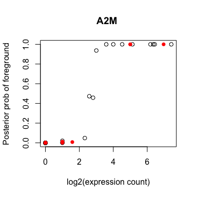
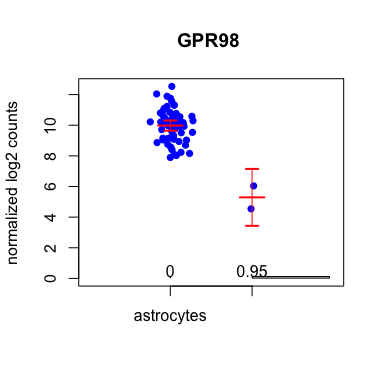
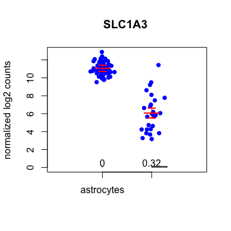

**SC2P: Two-phase differential expression for single-cell RNA-seq**
================

`SC2P` is a package designed for testing differential expression (DE) for data from single-cell RNA-seq experiment. It provides functionalities for testing DE in two phases: (1) phase transition (difference in the probabilities of being expressed); and (2) magnitude tuning (difference in the levels of expression once the gene is on).

**1. Introduction**
================

Single-cell RNA-sequencing (scRNA-seq) has emerged recently as a powerful technology to investigate transcriptomic variation at the individual cell level. Compared to traditional ***bulk*** RNA-seq, scRNA-seq reveals much detailed information for inter-cellular heterogeneities. scRNA-seq data show clear evidence of binary status of transcription, which we refer to as ***phases*** in transcription: **Phase I** corresponds to low level non-specific transcription (for example, as a result of random initiation), and **Phase II** corresponds to targeted specific transcription. The regulation of transcription includes a phase transition between Phase I to Phase II, as well as continuous regulation within Phase II. Both are important regulatory mechanisms that need to be identified in the DE analysis.

The **SC2P** package identify DE genes in two phases seperately. It implements a rigorous statistical method to determine the phases for all genes in all cells in a data-driven way, with consideration of cell- and gene-specific characteristics. Compared with methods using an *ad hoc* thresholds to determine phases, SC2P achieves better sensitivity and accuracy.

##2. Installation

Run following commands in R:

```
library(devtools)
install_github("haowulab/SC2P", build_vignettes=TRUE)
```

The second line might take a little time and install some extra packages for building the package vignette.

To view the package vignette, do

```
library(SC2P)
vignette("SC2P")
```

The content in this README file is essentially the same as the package vignette.

##3. Use SC2P

SC2P starts from a count matrix for gene expressionsm, and a data frame for cell information. In the count matrix, each row corresponds to a gene and each column corresponds to a cell. Each row of the cell information data frame contains the annotation for a cell. The number of columns of the count matrix and the number of rows for the cell data frame must match. Below we will use a small part of a public human brain dataset (GSE67835) to illustrate the workflow of SC2P. The data is distributed with SC2P as `brain_scRNAseq`.

**1. Load library and example data**

``` r
library(SC2P)
data(brain_scRNAseq)
```

**2. Create an `ExpressionSet` object out of the count matrix and cell information data frame.**

``` r
colnames(Y) <- rownames(design)
phenoData <- new("AnnotatedDataFrame", data=design)
eset <- ExpressionSet(assayData=Y, phenoData=phenoData)
eset
```

    ## ExpressionSet (storageMode: lockedEnvironment)
    ## assayData: 10483 features, 100 samples 
    ##   element names: exprs 
    ## protocolData: none
    ## phenoData
    ##   sampleNames: 15 62 ... 310 (100 total)
    ##   varLabels: tissue celltype ... adult (6 total)
    ##   varMetadata: labelDescription
    ## featureData: none
    ## experimentData: use 'experimentData(object)'
    ## Annotation:

**3. estimate the phases for all genes in all cells using `eset2Phase` function.** This returns an object of `sc2pSet`.

``` r
data <- eset2Phase(eset)
data
```

    ## sc2pSet (storageMode: lockedEnvironment)
    ## assayData: 10483 features, 100 samples 
    ##   element names: exprs, Offset, Z 
    ## protocolData: none
    ## phenoData
    ##   sampleNames: 15 62 ... 310 (100 total)
    ##   varLabels: tissue celltype ... L (9 total)
    ##   varMetadata: labelDescription
    ## featureData
    ##   featureNames: A2M A2ML1 ... alignment_not_unique (10483 total)
    ##   fvarLabels: mean sd
    ##   fvarMetadata:
    ##     c..shrinkage.estimated.foreground.mean....shrinkage.estimated.foreground.standard.deviation.
    ##     labelDescription
    ## experimentData: use 'experimentData(object)'
    ## Annotation:

The phase estimation result can be visualized using `zyPlot` function, which plots the posterior probability of being expressed versus log expression. Two groups will be shown in different colors.

``` r
zyPlot(rownames(data)[1], data, group.name="celltype")
```



**4. test DE in two phases using `twoPhaseDE` function.**

Here - `design` is a character vector of variable names in pData(norm2) to provide regression covariates in the DE test. - `test.which` is an integer that points to the location of the to-be-tested binary variable in argument `design`. - `offset` indicates the method to compute normalization factor.

``` r
de.sc2p <- twoPhaseDE(data, design="celltype", test.which=1, offset="sf")
```

The function returns a data frame, each row is for a gene. The rows are sorted by the gene name, not significance level.

**5. Top ranked genes can be obtained using `topGene` function, and visualized by `visGene` function.**

There are differnt options in `topGene`:

-   To list the top 5 DE genes in phase I:

``` r
 topGene(de.sc2p, phase=1, number=5)
```

    ##   Gene.name    p1    p2 Ph1.coef Ph1.fdr   m1   m2 Ph2.coef marLogFC
    ## 1    GPR98  1.000 0.053    -24.5 8.0e-23 10.6  5.6    -4.98   -10.12
    ## 2       F3  0.984 0.026     -7.7 9.4e-23 10.0  7.1    -2.90    -9.47
    ## 3    ENPP2  0.048 1.000     23.5 1.3e-22  5.7 10.2     4.49     8.96
    ## 4  LRRC16A  0.952 0.000    -23.5 1.3e-22  9.7   NA       NA    -9.11
    ## 5     RYR3  0.968 0.026     -7.0 7.1e-22  9.2  3.1    -6.05    -8.71
    ##   Ph2.fdr Phase1 Phase2 Comb.fdr Category
    ## 1 5.3e-04      Y      Y  8.0e-23       --
    ## 2 4.9e-01      Y      N  1.3e-22       --
    ## 3 7.9e-04      Y      Y  2.0e-22       ++
    ## 4      NA      Y     NA  2.0e-22       NA
    ## 5 2.4e-02      Y      Y  1.2e-21       --

-   To list the top 5 DE genes in phase II:

``` r
 topGene(de.sc2p, phase=2, number=5)
```

    ##   Gene.name    p1    p2 Ph1.coef Ph1.fdr   m1   m2 Ph2.coef marLogFC
    ## 1   SLC1A3  1.000 0.684   -19.79 6.9e-06 11.8  7.2     -4.6   -6.528
    ## 2      CLU  1.000 0.605   -20.14 2.0e-07 11.5  6.8     -4.7   -6.978
    ## 3  SPARCL1  1.000 0.316   -21.34 2.9e-14 12.2  7.3     -4.9   -9.247
    ## 4  PIP4K2A  0.548 1.000    19.37 2.3e-07  8.3 12.3      4.0    6.872
    ## 5  TMEM144  0.371 1.000    20.09 3.6e-11  6.8 11.5      4.7    8.215
    ##   Ph2.fdr Phase1 Phase2 Comb.fdr Category
    ## 1 5.5e-23      Y      Y  8.0e-23       --
    ## 2 1.6e-16      Y      Y  2.0e-17       --
    ## 3 1.5e-15      Y      Y  2.1e-16       --
    ## 4 1.9e-15      Y      Y  3.2e-16       ++
    ## 5 3.7e-15      Y      Y  6.3e-16       ++

-   To list the top 5 DE genes in both phases:

``` r
topGene(de.sc2p, phase="both", number=5)
```

    ##   Gene.name    p1    p2 Ph1.coef Ph1.fdr   m1   m2 Ph2.coef marLogFC
    ## 1    GPR98  1.000 0.053   -24.46 8.0e-23 10.6  5.6    -4.98  -10.119
    ## 2   SLC1A3  1.000 0.684   -19.79 6.9e-06 11.8  7.2    -4.59   -6.528
    ## 3       F3  0.984 0.026    -7.72 9.4e-23 10.0  7.1    -2.90   -9.473
    ## 4    ENPP2  0.048 1.000    23.54 1.3e-22  5.7 10.2     4.49    8.955
    ## 5  LRRC16A  0.952 0.000   -23.54 1.3e-22  9.7   NA       NA   -9.109
    ##   Ph2.fdr Phase1 Phase2 Comb.fdr Category
    ## 1 5.3e-04      Y      Y  8.0e-23       --
    ## 2 5.5e-23      Y      Y  8.0e-23       --
    ## 3 4.9e-01      Y      N  1.3e-22       --
    ## 4 7.9e-04      Y      Y  2.0e-22       ++
    ## 5      NA      Y     NA  2.0e-22       NA

To visualize expression distribution using `visGene` function:

-   Top DE gene in phase I

``` r
visGene(topGene(de.sc2p, 1)$Gene.name[1], data, group.name="celltype")
```



-   Top DE gene in phase II

``` r
visGene(topGene(de.sc2p, 2)$Gene.name[1], data, group.name="celltype")
```



